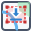

# Quick Canvas Export - QGIS Plugin

**Quick Canvas Export** is a lightweight, highly efficient QGIS 3 plugin that allows you to instantly draw a bounding box on your map canvas and export exactly that region as a high-resolution image or copy it directly to your clipboard. 

It completely bypasses the need to set up formal Print Layouts for quick map snapshots, while still giving you access to professional cartographic elements like scale bars, coordinate grids, and north arrows.

## ✨ Features

*   🎨 **Interactive Map Drawing:** Click and drag a stable, red-dashed bounding box directly on your map canvas.
*   ⚙️ **Live Preview Dialog:** Adjust your settings and see the final export dynamically update in real-time.
*   📏 **Smart Scale Bars:** Supports Kilometers, Miles, Nautical Miles, Meters, and Feet. Let the plugin auto-calculate the math, or manually set your tick segments and max values.
*   🧭 **True North Arrow:** Automatically aligns to True North based on your active project CRS.
*   🌐 **Geographic Coordinate Grids:** Instantly add an exterior map frame with decimal degrees. The plugin auto-reprojects to EPSG:4326, mathematically trims trailing zeros, and dynamically appends N/S/E/W suffixes.
*   🪟 **Transparency Support:** Easily toggle a transparent background for both the map and the layout margins—perfect for overlaying maps in reports or presentations.
*   📋 **One-Click Export:** Copy the high-res (300 DPI) output straight to your clipboard, or save it as a PNG/JPG.
*   🗂️ **Extent Tracking:** Every region you draw is saved as a timestamped in-memory layer (e.g., `Export Region 14:32:05`), making it easy to return to previous extents. (These layers are automatically hidden from the final export image).

## 🚀 Installation

### Option 1: Install from ZIP
1. Download this repository as a `.zip` file (Click **Code** > **Download ZIP**).
2. Open QGIS.
3. Go to **Plugins** > **Manage and Install Plugins...**
4. Select the **Install from ZIP** tab.
5. Browse to the downloaded `.zip` file and click **Install Plugin**.

### Option 2: Manual Installation
1. Clone or download this repository.
2. Extract the folder and rename it to `quick_export`.
3. Move the folder to your QGIS Python plugins directory:
   * **Windows:** `%APPDATA%\QGIS\QGIS3\profiles\default\python\plugins\`
   * **Mac:** `~/Library/Application Support/QGIS/QGIS3/profiles/default/python/plugins/`
   * **Linux:** `~/.local/share/QGIS/QGIS3/profiles/default/python/plugins/`
4. Restart QGIS and enable the plugin in the Plugin Manager.

## 🛠️ Usage

1. Look for the **Quick Canvas Export** icon (a map canvas with a red dashed crop box and a blue download arrow) in your QGIS toolbar.
2. Click the tool, then click and drag on the map canvas to define your export area.
3. When you release the mouse, the **Export Preview** window will appear.
4. **Customize your layout:**
   * Toggle the **Scalebar** and change units.
   * Add a **Decimal Degree Map Frame** and adjust the tick interval.
   * Add a **North Arrow**.
   * Change the global font style or independently adjust the scale bar and frame font sizes.
   * Toggle **Transparent Background** on or off.
5. Click **Copy to Clipboard** to paste it immediately into a document, or **Export to File** to save it to your machine.

## ⚙️ Requirements
* QGIS 3.x
* PyQt5

## 📝 License
This project is licensed under the [GNU General Public License v2.0 (GPL-2.0)](LICENSE) or later, the standard license for QGIS plugins.

---
*Created to make QGIS mapping workflows faster and more efficient.*
